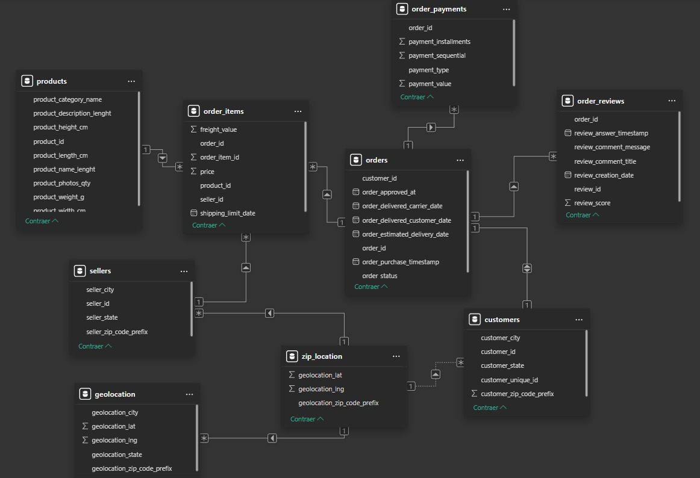
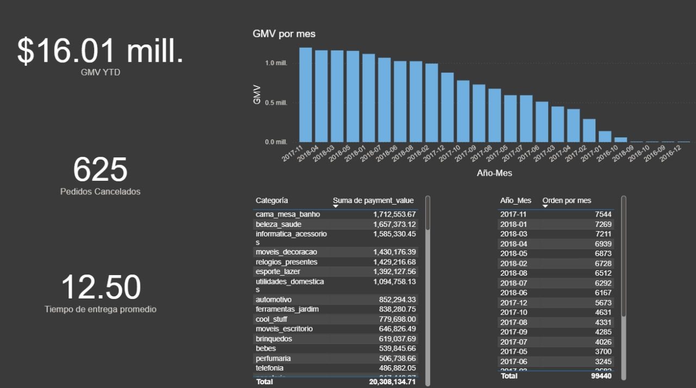
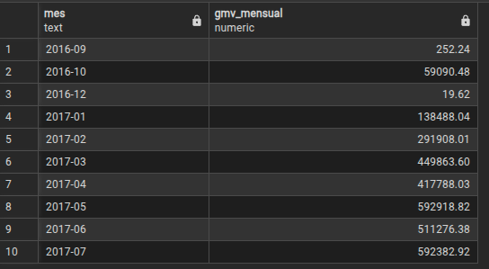
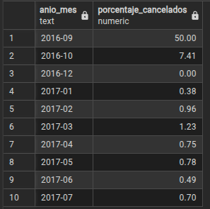
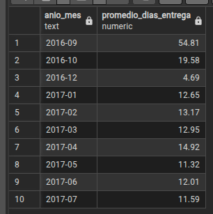
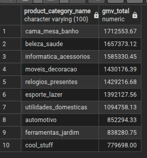
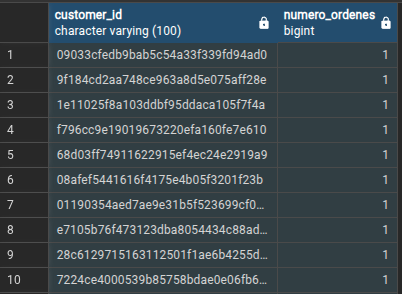
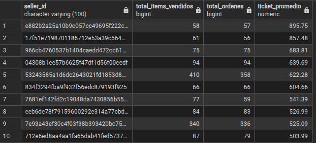
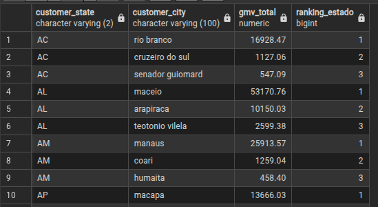

# BIAnalyst

Olist es una plataforma que ofrece soluciones para la gestión y crecimiento de negocios en línea.

El dataset utilizado en este proyecto Brazilian E-Commerce Public Dataset by Olist 
https://www.kaggle.com/datasets/olistbr/brazilian-ecommerce?select=olist_customers_dataset.csv 

Link del proyecto Github: https://github.com/JonathanMeriino/BIAnalyst

## Power BI
-Modelado de datos

- clientes (customer_id, customer_unique_id, customer_city, customer_state)
- ordenes (order_id, customer_id, order_status, order_purchase_timestamp, order_delivered_customer_date)
- items_pedido (order_id, product_id, seller_id, price, freight_value)
- pagos (order_id, payment_type, payment_value)
- productos (product_id, product_category_name)
- vendedores (seller_id, seller_city, seller_state)
- reseñas (review_id, order_id, review_score)
- geolocalización (geolocation_zip_code_prefix, geolocation_lat, geolocation_lng, geolocation_city, geolocation_state)

Relaciones: 

-Orders se conecta con customers, order_items, payments, reviews
-Order_items conecta con products y sellers
-Customers y sellers pueden vincularse con geolocation por zip_code_prefix

-GMV (ingresos brutos) por mes
Pasos:
1. Abrir power query
2. Selecconar la tabla orders y validar que la columna order_purchase_timestamp sea tipo fecha (cambiarlo si es texto)
3. Ir a Agregar columna → Columna personalizada y usar esta formula: Date.ToText([order_purchase_timestamp], "yyyy-MM") para creaar una nueva colmna en la tabla
4. Se renombra la nueva columna como Year_month
5. Ir a Inicio → Combinar consultas → Combinar consultas como nuevas
6. Seleccionar orders como tabla principal, order_payments como tabla secundaria, relacion order_id en ambas, tipo de combinacion interna y despues Aceptar
7. Se expande la columna combinada para incluir solo payment_value y se renombra la nueva tabla como orders_payments

-Nº de órdenes por mes.
Contar cuantas ordenes (order_id) se realizaron en cada mes usando la columna Year_month que se genero

-Tiempo promedio de entrega 
Pasos:
1. Selecciona la tabla orders y verificar que las columnas (order_purchase_timestamp, order_delivered_customer_date) esten en formato Fecha
2. Ir a Agregar columna → Columna personalizada y escribir esta formula: Duration.Days([order_delivered_customer_date] - [order_purchase_timestamp])
3. Validar que la nueva columna este en formato de Numero entero y renombrarla a "dias_entrega"

-Ordenes canceladas por mes
Pasos:
1. En PowerQuery seleccionar la tabla ooders
2. Ir a Agregar ccolumna → Columna personalizada y escribir esta formula: if [order_status] = "canceled" then 1 else 0
3. Renombrar la columna como esta_cancelada y verificar que este en tipo de dato entero
4. Commbinar el resultado  con order_payments como tabla secundaria, relacion order_id, tipo de combinacion interna y aceptar
5. Expandir solo payment_value y renombrar la tabla combinada como items_with_category_and_payment
6. Verificar que pdocut_category_name sea tipo texto y payment_value sea tipo decimal

-Categorías por GMV y su contribución 
Pasos:
1. Ir a Combinar consultas → Combinar como nuevas
2. Seleccionar order_item como tabla principal, products como secundaria,   relacion product_id , tipo de combinacion interna y aceptar
3. Expande solo "product_category_name"

### Insights

-Hubo un total de 625 pedidos cancelados, siendo la fecha 2018-02 con el mayor numero de cancelados (81)
- La categoria con mayor GMV es "cama_mesa_banho" con $1712553.67
- La fecha 2017-11 es la que tuvo el mayor numero de ordenes con 7544
- El tiempo de entrega promedio es de 12.5 dias
- SP es la ciudad con el mayor numero de GMV

### SQL
- Herrammientas utilizadas: PostgreSQL , pgAdmin
1.	GMV mensual: total de payments.payment_value por año-mes de order_purchase_timestamp.

2.	% de pedidos cancelados por mes (order_status = 'canceled').

3.	Tiempo promedio (en días) entre order_purchase_timestamp y order_delivered_customer_date por mes.

4.	Top 10 categorías por GMV (usa order_items unido a products y payments).

5.	Clientes 'recurrentes': lista customer_id con más de 1 orden y su número de órdenes.

6.	Vendedores con ticket promedio (sum(price)/#órdenes) más alto y al menos 50 ítems vendidos.

7.	Ranking de ciudades por GMV y top 3 por estado (usa una ventana PARTITION BY customer_state).

### Python
-Herramientas utilizadas: Spyder IDE , Python 3.13 ( Pandas)

Explica brevemente (2–3 líneas) la diferencia entre inner join y left join y un ejemplo de uso en pandas.merge.

-Inner join (how=’inner’) →  Incluye las filas que tienen coincidencia en ambos dataframes y no  genera valores faltantes en las columnas de la clave de union.

-left join (how=”left”)→ Incluye todas las filas del dataframe de la izquierda y solo las filas coincidentes del dataframe de la derecha. Respecto a los valores faltantes, los genera en las columnas del dataframe derecho cuando no hay coincidencias.

Ejemplo de uso: 

Unir SOLO las filas que tienen un 'order_id' en AMBOS DataFrames df_inner = pd.merge( left=df_pedidos, right=df_reviews, on='order_id', how='inner' )
Unir TODAS las filas de df_pedidos, agregando la información de la reseña df_left = pd.merge( left=df_pedidos, right=df_reviews, on='order_id', how='left' )
